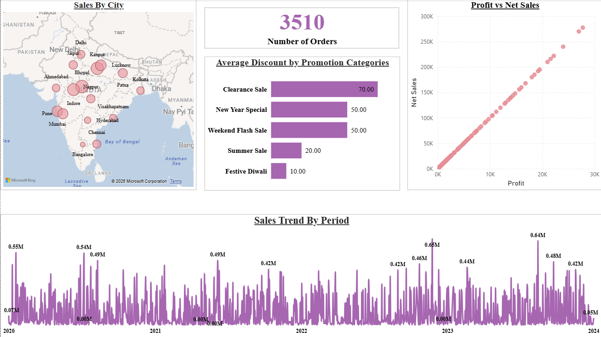
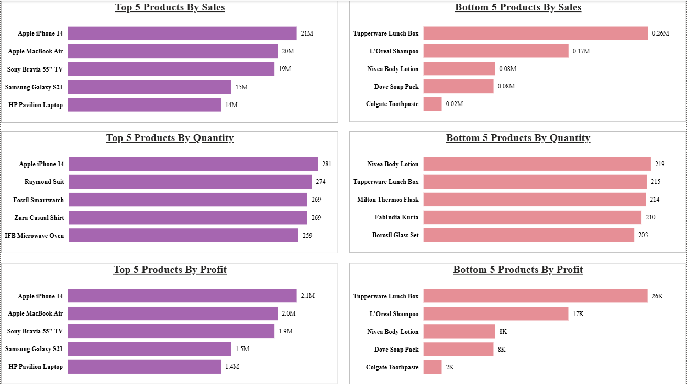
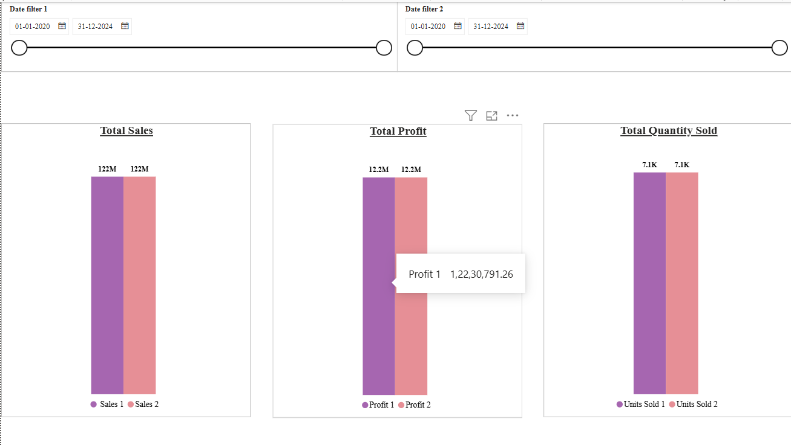
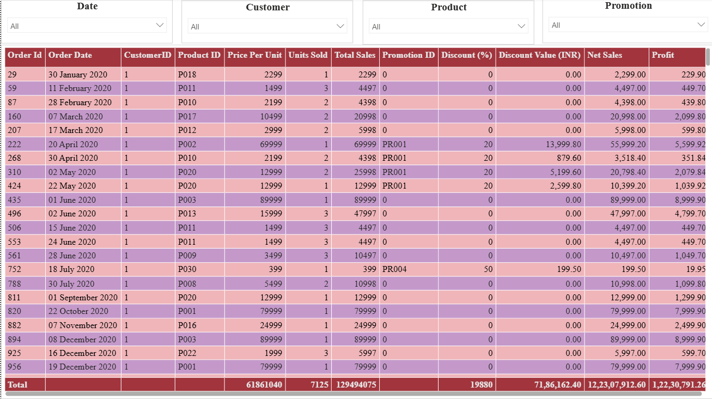

# ElectroHub Sales Analytics Dashboard

## Overview

This project presents an end-to-end Sales Analytics Dashboard developed in Power BI for ElectroHub, a multi-category retail business. The dashboard enables business stakeholders to monitor sales performance, profitability, product trends, promotional effectiveness, and geographic sales distribution through interactive visualizations and KPI tracking. It was developed as part of hands-on 

The objective of the project was to transform raw transactional data into actionable business insights that support data-driven decision-making.

---
### Project Context

This project was completed as part of a Data Analytics Bootcamp and served as a practical business intelligence case study. The objective was to translate business requirements into a fully functional Power BI dashboard by performing data modeling, KPI development, and interactive report design.

## Business Problem

Retail organizations generate large volumes of sales data across products, customers, locations, and promotional campaigns. Without a centralized analytics solution, it becomes difficult to:

* Identify top and underperforming products.
* Track sales trends over time.
* Evaluate the effectiveness of promotional campaigns.
* Understand regional sales performance.
* Compare business performance across different periods.
* Monitor profitability alongside revenue growth.

This dashboard addresses these challenges through interactive reporting and analytical visualizations.

---

## Project Objectives

The dashboard was designed to answer the following business questions:

1. Which products generate the highest and lowest Sales, Profit, and Quantity Sold?
2. How do sales trends vary across daily, monthly, quarterly, and yearly periods?
3. What is the relationship between Sales and Profit?
4. How does business performance compare across user-selected periods?
5. What is the average discount offered across discount categories?
6. How many total orders were processed?
7. How can users analyze order-level details using interactive filters?
8. Which cities contribute the most to overall sales?

---

## Key Performance Indicators (KPIs)

The dashboard tracks the following metrics:

* Total Sales
* Total Profit
* Total Quantity Sold
* Total Orders
* Net Sales
* Average Discount
* Product Performance Metrics
* City-wise Sales Performance

---

## Dashboard Features

### Product Performance Analysis

* Top 5 Products by Sales
* Bottom 5 Products by Sales
* Top 5 Products by Profit
* Bottom 5 Products by Profit
* Top 5 Products by Quantity Sold
* Bottom 5 Products by Quantity Sold

### Sales Trend Analysis

* Daily Sales Trends
* Monthly Sales Trends
* Quarterly Sales Trends
* Annual Sales Trends

### Profitability Analysis

* Sales vs Profit Relationship
* Profit Contribution Analysis
* Product-Level Profitability

### Comparative Analysis

* Dynamic comparison between two selected periods
* Performance variance tracking
* Trend evaluation

### Discount Analysis

* Average Discount by Category
* Promotion Performance Insights

### Geographic Analysis

* Sales by City
* Regional Performance Comparison

### Interactive Reporting

Users can dynamically filter reports using:

* Product
* Customer ID
* Date
* Promotion Category
* Sales Metrics

---

## Tools & Technologies

| Technology    | Purpose                                 |
| ------------- | --------------------------------------- |
| Power BI      | Dashboard Development                   |
| Power Query   | Data Transformation & Cleaning          |
| DAX           | KPI & Measure Creation                  |
| Data Modeling | Star Schema Design                      |
| GitHub        | Version Control & Project Documentation |

---

## Skills Demonstrated

### Business Intelligence

* Dashboard Design
* KPI Development
* Business Reporting
* Data Visualization

### Data Analytics

* Trend Analysis
* Performance Monitoring
* Profitability Analysis
* Comparative Analysis

### Power BI

* Data Modeling
* Relationship Management
* Power Query Transformations
* DAX Calculations
* Interactive Slicers & Filters

---

## Key Learnings

Through this project, I gained practical experience in:

* Designing scalable Power BI data models.
* Implementing Star Schema architecture.
* Building interactive business dashboards.
* Creating DAX measures for business KPIs.
* Translating business requirements into analytical solutions.
* Developing reports that support executive decision-making.

---

## Dashboard Preview

### Overview

- 

### Product Performance Analysis

- 

### Sales Trend Analysis

- 

### Complete Order Profile

- 

---

## Future Enhancements

Potential improvements for future versions include:

* Profit Margin Analysis
* Customer Segmentation
* Sales Forecasting
* Inventory Optimization Insights
* Advanced DAX Measures
* Drill-through Reporting
* Automated Data Refresh Integration
